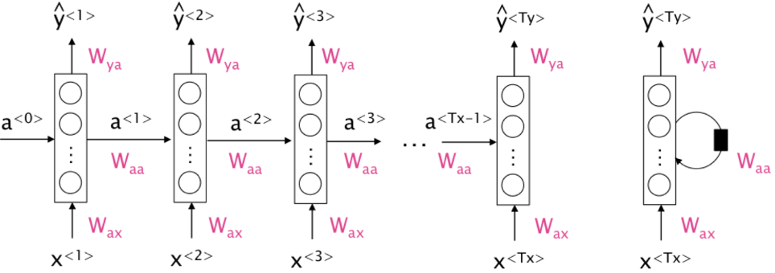
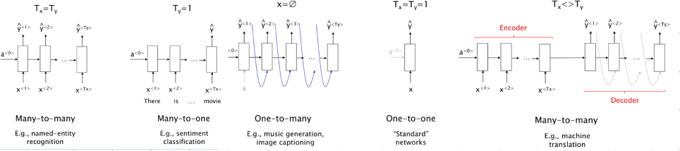

# Modelli sequenziali

Tra le varie tipologie di algoritmi di Machine Learning, soprattutto nel settore di riconoscimento ed analisi di dati testuali, spiccano i modelli sequenziali.

La caratteristica principale nella tipologia di dato testuale, rispetto ad altri formati come immagini e video, risiede nel fatto che non ha molto senso specificare una lunghezza costante del dato in input.

Ad esempio, nel caso di immagini è possibile sviluppare algoritmi convoluzionali che attraverso prodotti matriciali sono in grado di estrarre le feature da sfruttare per effettuare predizioni o generazioni. Per effettuare tali calcoli è necessario che l’immagine in input abbia una specifica dimensione (da intendere come dimensioni di una matrice) affinché i prodotti matriciali siano fattibili.
Per ottenere tale risultato è possibile effettuare dell’image pre-processing per fare crop/stretch dell’immagine e quindi raggiungere la corretta risoluzione.

Vien da sé che nel caso di dati di tipo testuale tali operazioni non sono fattibili, per cui è comunque necessario strutturare un modello “determinato”, con uno specifico numero di layer e relativi pesi. Tuttavia il training, e quindi applicazione, di tale modello segue un flusso differente, dando origine ai modelli sequenziali/ricorrenti.
In questo caso il modello viene applicato su una frase avendo di volta in volta in input la parola attuale (x<i>) e un valore di attivazione che raggruppa i valori precedenti (a<i-1>), riuscendo a generare quindi il relativo output (y<i>) e il “raggruppamento” da usare per il successivo nodo (a<i>).
Quest’architettura non ha quindi una dipendenza dalla lunghezza dell’input

 

Sulla destra è possibile notare il modello ricorrente nella sua forma generica, mentre sulla sinistra un esempio di un suo sviluppo. In funzione del task che si intende compiere, è possibile sviluppare il modello selezionando opportunamente gli iper-parametri che lo dominano, come ad esempio la relazione che intercorre tra la dimensione dell’input (Tx) e quella dell’output (Ty).

 
 

In quest’immagine è possibile vedere alcuni esempi di task, nello specifico:
⁃	Nel primo caso genero un output di pari dimensione all’input. Quest’output potrebbe rappresentare la probabilità in cui ogni parola in input possa essere un aggettivo, oppure un sostantivo e così via.

⁃	Nel secondo caso abbiamo un esempio di classificazione, in cui l’output ci dice con che probabilità la frase appartiene ad una determinata classe. Ad esempio capire se la frase ha un tono allegro o arrabbiato.

⁃	Il terzo caso inizia ad andare nella direzione di algoritmi generativi, infatti a partire da un input integrato nella stessa rete, è in grado di generare una sequenza di oggetti, magari parole che compongono una frase o sample che generano una melodia. Questo genere di rete potrebbe anche essere unito in cascata ad una rete convoluzionale in grado di estrarre delle feature da un’immagine e quindi generarne una caption.

⁃	Il quarto esempio è relativamente banale, in questo caso sta venendo specificata la dimensione dell’input, per cui si torna al caso classico di modelli non sequenziali/ricorrenti.

⁃	L’ultimo caso rappresenta un importante esempio per la GenAI, infatti attraverso una differente dimensione di input ed output è possibile ottenere un’architettura di tipologia Encoder-Decoder che a partire da un input genera un output di dimensione sconnessa, potrebbe essere quindi il primo modello utilizzabile per creare un tool di chat tramite AI.

Questa dunque rappresenta l’idea di base dietro le RNN (Recurrent Neural Network). I primi paper che discutono di tale architettura risalgono al 1997, dove però sono state svolte delle analisi per identificare e risolvere alcuni problemi dell’architettura. Uno tra i principali è legato al problema di “Vanishing Gradient”, di cui in generale soffrono le reti particolarmente profonde, e quindi anche l’architettura RNN avente una plausibile profondità infinita.

La soluzione a problematiche del genere è stata effettuata attraverso una raffinazione del nodo ricorrente, introducendo dei meccanismi di memoria, definendo celle di tipo LSTM (Long Short-Time Memory), di cui tratta il primo paper del MIT sull’argomento

=> https://deeplearning.cs.cmu.edu/S23/document/readings/LSTM.pdf

Spero di aver attirato la vostra “attenzione” con questa breve descrizione delle RNN. Il discorso è ancora ben lontano dal concludersi, basti pensare che questi modelli non hanno consapevolezza del “futuro”!

Ad esempio se dovessi classificare la parola “Teddy” in queste due frasi:
⁃	Teddy bear
⁃	Teddy Roosvelt
Il significato sarebbe differente, tuttavia per discriminarle basterebbe avere visione delle parole successive.
La soluzione per problemi del genere è caratterizzata da modelli ricorrenti bidirezionali, su cui si basa il meccanismo di “attenzione”.
