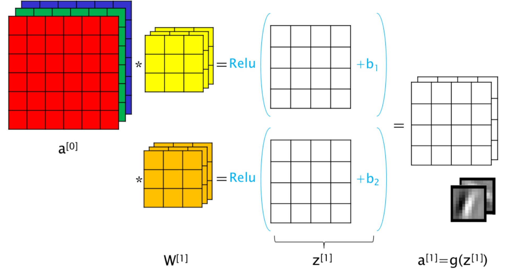
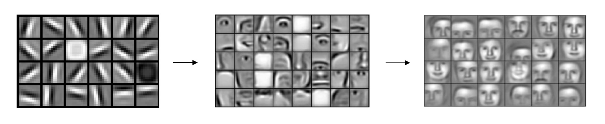
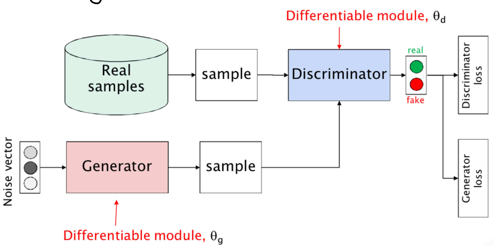

# AI per Immagini e reti convoluzionali

Tra i task AI più diffusi spiccano sicuramente quelli relativi a riconoscimento e generazione di immagini. Le informazioni contenute in un’’immagine sono identificate attraverso i valori delle componenti RGB del singolo pixel, avente una determinata posizione nell’immagine bidimensionale.

Le immagini vengono quindi rappresentate attraverso delle matrici aventi dimensioni pari alla risoluzione dell’immagine stessa e valori pari al colore del relativo pixel, dviso nelle sue componenti RGB.

Avendo ben chiaro il tipo di dato, la costruzione dell’algoritmo dovrà anche tenere in considerazione delle proprietà più astratte dell’immagine, in quanto l’obbiettivo è sempre quello di estrarre delle feature da utilizzare per poi classificare immagini o generarne di altre. Le feature che quindi possono essere più intuitive potrebbero riguardare banalmente il contorno di un oggetto, o il colore/pattern decorativo di una porzione di spazio, in generale tutte caratteristiche che non analizzano il singolo pixel, bensì un’area dello spazio da cui è possibile valutarne la presenza.

La scelta dell’algoritmo è ricaduta quindi sulla costruzione di neuroni convoluzionali, dove quello che viene fatto è effettuare il prodotto di convocazione tra i layer dell’immagine (dove per layer si intende la matrice relativa ad un determinato colore RGB che compone l’immagine) con un filtro (matrice di pesi che vengono allenati dalla rete), il risultato sarà infine input per una funzione di attivazione in maniera analoga alle altre reti.

NB: a partire da un’immagine rappresentata da una matrice tridimensionale (dove la terza dimensione rappresenta il layer del colore RGB) e un filtro bidimensionale si ottiene una matrice bidimensionale, è possibile usare più neuroni (quindi più filtri) per poter calcolare più layer in output, come mostra la seguente immagine in cui vengono utilizzati 2 neuroni.

Un’elemento di particolare interesse di quest’ultima immagine è proprio la rappresentazione in basso a destra dell’output ottenuto. Questi sono naturalmente rappresentati in scala di grigio perché ognuno è relativo ad una singola matrice ma ci comunica che in qualche modo quei filtri, a valle di un allenamento, si attivavano quando riconoscono probabilmente dei bordi aventi l’inclinazione rappresentata.

Il gioco quindi è fatto, il processo viene reiterato estraendo via via feature sempre meno astratte, in funzione del task in oggetto. La seguente immagine mostra come inizialmente sono riconosciuti solo dei contorni, successivamente dei componenti del viso umano e infine dei veri e propri volti. Vien da se che quindi la seguente rete probabilmente è relativa a task dedicati a visi umani:

Tornando al tema della GenAI, questo tipo di architetture viene spesso poi combinato nel modello GAN (Generative Avversaria Network). Questo tipo di architetture  è caratterizzato da due componenti: un generatore e un discriminatore, entrambi modelli da allenare in maniera parallela.

Il discriminatore ha il compito di analizzare un’immagine di input e capire se questa è reale (quindi presa dal training set) oppure generata dal generatore. Affinchè il training possa procedere si vuole che l’accuratezza del discriminatore resti sempre intorno al 50%, così che il generatore possa sempre essere in grado di apprendere come migliorare l’immagine ai fini di essere in grado di ingannare il discriminatore.

Questa è un’immagine che in qualche modo spiega l’architetture:

L’unico tema lasciato fuori è il noise vector, infatti per poter permettere al generatore di generare sempre immagini differenti, gli viene fornito in input un vettore di numeri random ricavato da uno spazio vettoriale di una data dimensione. In qualche modo quindi la selezione del punto permetterà di determinare alcune caratteristiche dell’immagine generata, per cui è possibile sfruttare questa conoscenza per poter effettuare una generazione controllata.

Nello specifico, il noise vector potrebbe essere l’output di una rete sequenziale che estrae le principali feature da una frase, così da poter creare un prompt a cui richiedere la generazione di una determinata immagine.
