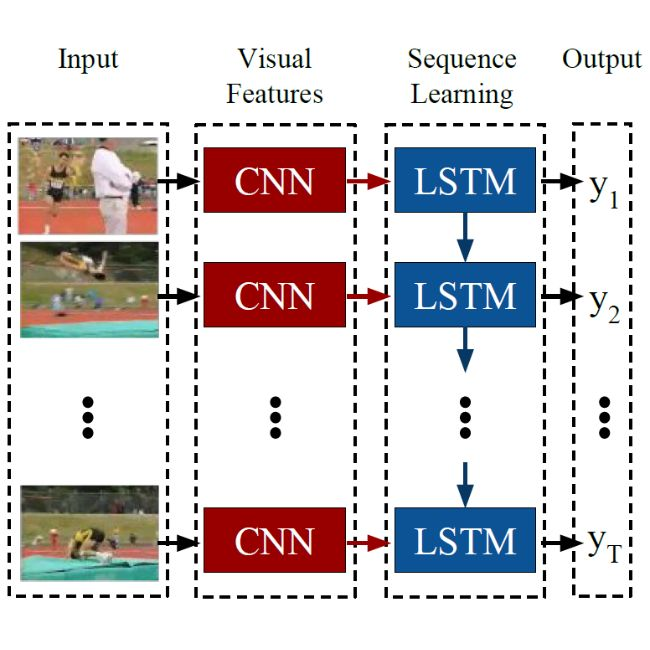
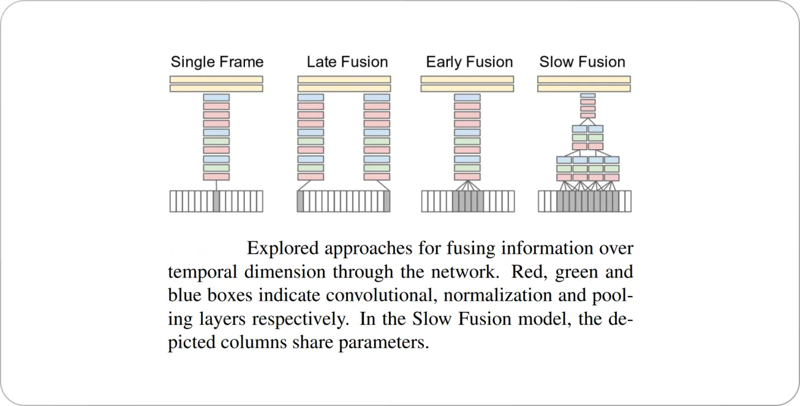
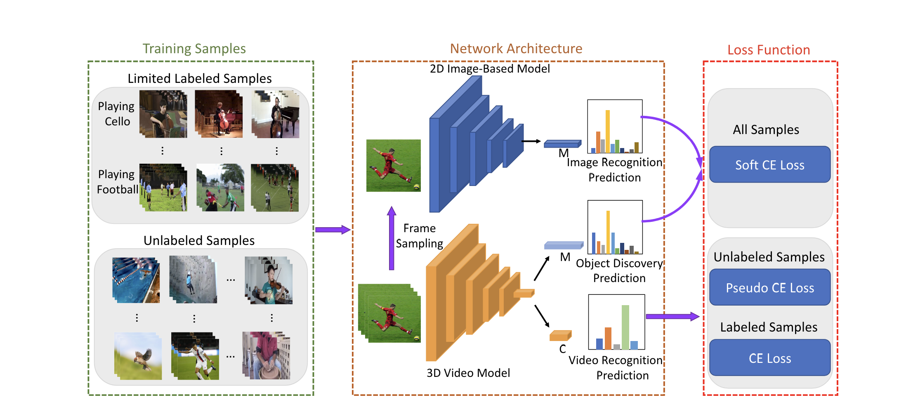
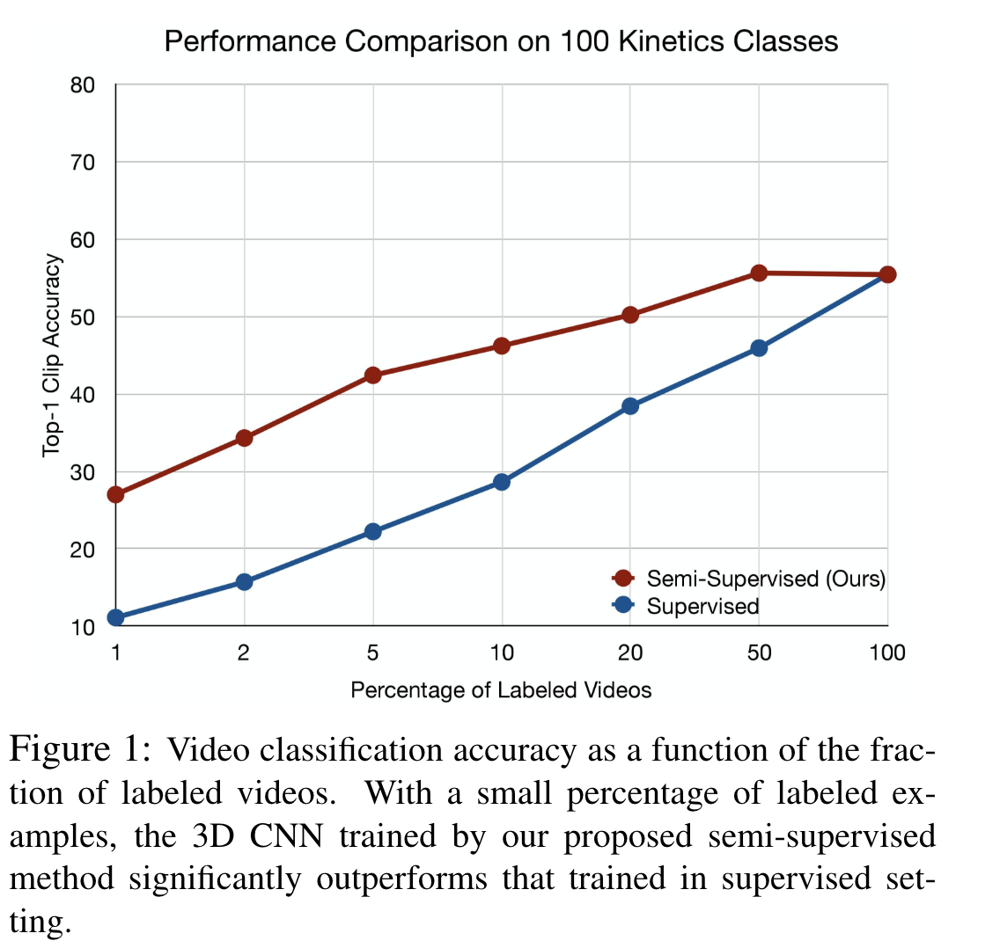

# AI per video e meccanismi di fusione

Nei precedenti documenti si è parlato di contenuti multimediali come audio e immagini, dove sono state analizzate rispettivamente reti ricorrenti e reti convoluzionali. In qualche modo gli algoritmi di Machine Learning che operano sui video sfruttano entrambe le tecniche.

Partiamo con un elemento fondamentale, ossia i dataset a disposizione. A differenza di immagini e audio dove sono disponibili enormi dataset ben etichettati, nel caso dei video la situazione è molto più complessa. I dataset disponibili sono relativamente piccoli, molto variegati e spesso senza delle buone label. Questo porta all’esigenza di implementare, oltre agli algoritmi supervisionati, degli algoritmi “semi-supervisionati”.

Tra i principali dataset spiccano Kinetics (400 000 video classificati per human action Recognition, HAR, con 600 classi) e YouTube-8M (circa 8 milioni di url di video YouTube classificati con più classi non solo relativi ad HAR).

Dal punto di vista degli algoritmi, bisogna considerare, come per il caso delle immagini, che le informazioni sono codificate in forma spaziale, ma anche, come per l’audio, in forma temporale. Questo suggerisce che una possibile prima tecnica potrebbe sfruttare CNN ed RNN opportunamente combinate, come mostrato nella seguente immagine:

I singoli frame dell’immagine vengono processati attraverso una rete CNN che estrae le feature da fornire ad una RNN. Questa tipologia di algoritmi richiede, per il training dei dati etichettati.

In qualche modo quindi la RNN sta effettuando una “fusione” dell’informazioni presenti dei vari frame per riuscire a costruire l’informazione temporale, tuttavia è possibile usare delle reti puramente convoluzionali e adoperare delle strategie di fusione, come mostrato nella seguente immagine: 

La single Frame Fusion sostanzialmente ignora l’informazione temporale non applicando nessun tipo di fusione, la Late Fusion punta a unire le informazioni estratte da due frame temporalmente lontani, analizzandoli su flussi separati, la Early Fusion analizza su un unico flusso le informazioni di più frame vicini mentre la Slow Fusion rappresenta una versione ibrida delle precedenti.

La strategia che ad oggi rappresenta lo stato dell’arte è la consolazione 3D che appunto sfrutta dei filtri tridimensionali che portando ad una implicita slow fusion implementata direttamente tramite AI. Tuttavia i parametri da allenare aumentano notevolmente, il che rende l’architettura molto lenta per sequenze di video più lunghe.

Per quanto riguarda gli algoritmi semi supervisionati, uno tra gli esempi più famosi è quello di [VideoSSL](https://arxiv.org/pdf/2003.00197):

Per una spiegazione dettagliata dell’algoritmo rimandiamo al paper, ma in sostanza viene utilizzata una bassa percentuale di dati classificati dove vengono usati gli algoritmi di classificazione precedentemente analizzati e una combinazione dell’etichetta fornita dal modello sotto training con quella fornita da modelli non supervisionati, ottenendo varie funzioni di ottimizzazione (Loss) che vengono combinate. Ciò che stupisce è come le performance nel caso di limitate quantità di dati etichettate aumenta notevolmente:

